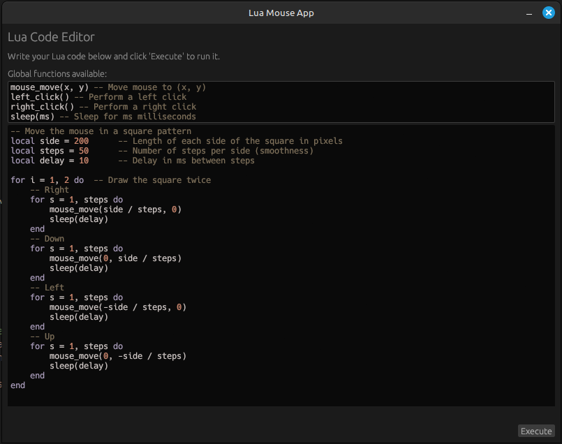

# Lua Mouse App

A simple Rust GUI application for running Lua scripts to control the mouse using egui/eframe, mlua, and enigo. Includes a code editor with syntax highlighting and mouse scripting functions.

**Tested on Linux. Should also work on macOS and Windows.**

## Packages Used
- [eframe](https://crates.io/crates/eframe) / [egui](https://crates.io/crates/egui): GUI framework
- [egui_extras](https://crates.io/crates/egui_extras) (with syntect): Syntax highlighting for code editor
- [mlua](https://crates.io/crates/mlua): Lua scripting engine
- [enigo](https://crates.io/crates/enigo): Cross-platform input simulation (mouse control)

## Features
- Lua code editor with syntax highlighting
- Execute Lua scripts to control the mouse
- Predefined mouse functions: `mouse_move(dx, dy)`, `left_click()`, `right_click()`, `sleep(ms)`
- Result/error display
- Fixed-size, non-resizable window

## TODO
- [x] Basic egui/eframe GUI
- [x] Lua scripting with mlua
- [x] Mouse control with enigo
- [x] Syntax highlighting in code editor
- [x] Scrollable, fixed-size code editor
- [x] Display Lua execution results/errors
- [x] Predefined mouse functions in Lua
- [ ] Add more Lua bindings (keyboard, etc.)
- [ ] UI/UX polish
- [ ] Add example scripts
- [ ] File import/export for Lua scripts

---

**Note:** This project was compiled and tested on Linux, but should work on macOS and Windows as well.
